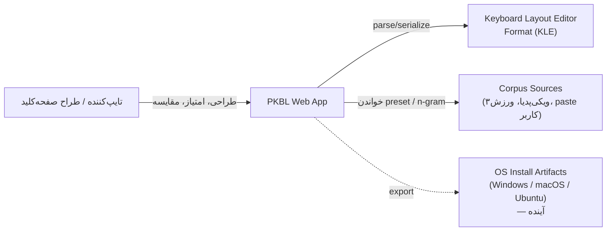
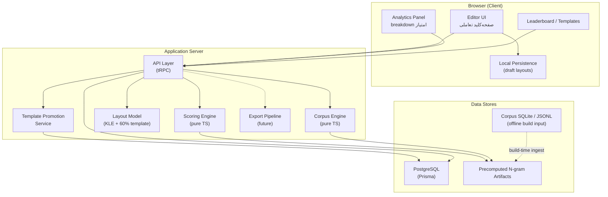
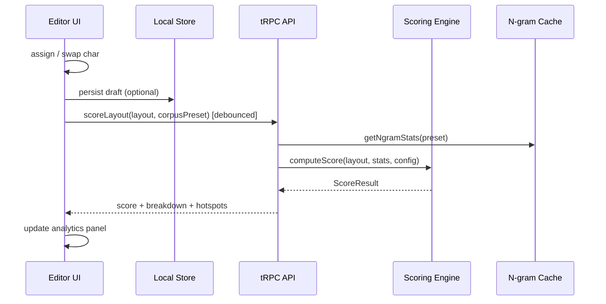
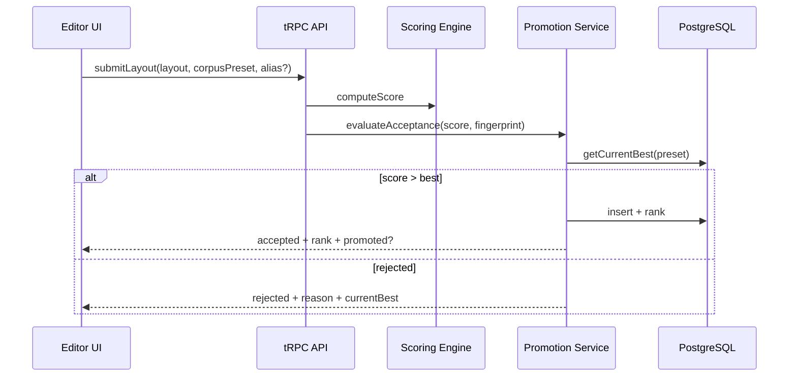
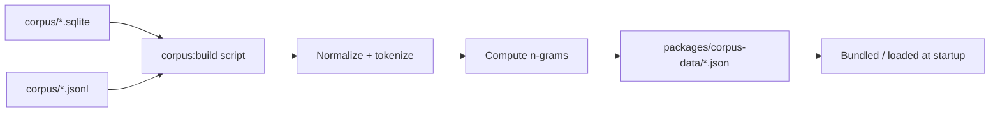
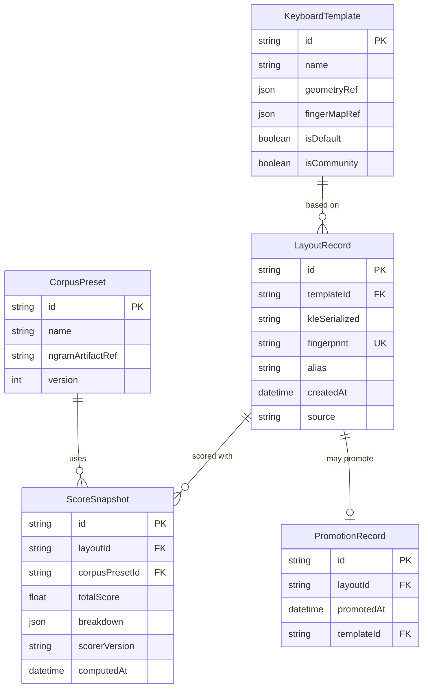

# سند معماری — آزمایشگاه چیدمان صفحه‌کلید فارسی (PKBL)

> **نسخه:** 0.1  
> **وضعیت:** پیش‌نویس  
> **مرجع:** [PRD](./prd.md)  
> **تاریخ:** ۱۴۰۵/۰۴/۰۷

---

## ۱. خلاصه

PKBL یک وب‌اپ تعاملی برای **طراحی، ارزیابی، مقایسه و حفظ** چیدمان‌های صفحه‌کلید فارسی است. ارزش اصلی محصول در موتور امتیازدهی مبتنی بر corpus، تحلیل ارگونومی تایپ ده‌انگشتی و جریان کاری صفحه‌کلید-محور است — نه صرفاً نمایش یا ویرایش ایستای layout.

این سند در دو لایه نوشته شده:

1. **لایهٔ دامنه (technology-agnostic):** ماژول‌ها، مرزها، جریان داده و قراردادها — مستقل از فریم‌ورک.
2. **لایهٔ پیاده‌سازی:** انتخاب T3 Stack (Next.js + TypeScript + tRPC + Prisma) به‌عنوان stack پیشنهادی و نقشهٔ ساختار پروژه.

---

## ۲. اهداف معماری

| هدف | توضیح |
|-----|--------|
| **جداسازی هندسه از منطق** | موقعیت فیزیکی کلیدها، تخصیص کاراکتر، و metadata امتیازدهی سه concern جدا باشند. |
| **Determinism** | همان layout + همان corpus + همان نسخهٔ scorer → همیشه همان امتیاز و breakdown. |
| **Testability** | موتور corpus و scorer به‌صورت pure function/module تست شوند، بدون وابستگی به UI یا DB. |
| **Extensibility** | pipeline export OS و corpus preset جدید بدون بازنویسی هسته اضافه شوند. |
| **Interactive latency** | امتیازدهی در حین ویرایش باید در بازهٔ «احساس real-time» (< ~200ms برای presetهای ازپیش‌محاسبه‌شده) باشد. |
| **سبکی نسخهٔ اول** | بدون auth، بدون export کامل، بدون ویرایشگر فیزیکی دلخواه — اما معماری برای آن‌ها فضا بگذارد. |

---

## ۳. زمینهٔ سیستم (C4 — Context)



**کنشگرها:**
- کاربر نهایی (بدون حساب در v1)
- اپلیکیشن PKBL
- منابع corpus (فایل‌های ازپیش‌آماده + متن paste شده)
- فرمت KLE به‌عنوان قرارداد تبادل layout

**خارج از مرز v1:** احراز هویت، moderation پیشرفته، بهینه‌ساز خودکار عمیق، export همهٔ پلتفرم‌ها.

---

## ۴. نمای کانتینر (C4 — Containers)



---

## ۵. ماژول‌های دامنه

### ۵.۱ Layout Model (`layout`)

**مسئولیت:** نمایش canonical چیدمان — parse/serialize KLE، نگهداری لایهٔ base و shift، و تفکیک **visible content** از **scoring metadata**.

**مفاهیم کلیدی:**

```
PhysicalKey     → شناسهٔ پایدار کلید روی قالب ۶۰٪ (مثلاً `K01`)
KeyAssignment   → { layer: base|shift, char: string }
Layout          → { templateId, assignments: Map<PhysicalKey, KeyAssignment[]>, kleRaw? }
EditableScope   → زیرمجموعهٔ کاراکترهای مجاز فارسی + نمادهای رایج (v1)
```

**قراردادها:**
- هندسهٔ فیزیکی (x, y, width, height, row, finger zone) در **Template Definition** ثابت است و از KLE geometry می‌آید.
- تخصیص کاراکتر mutable است؛ geometry immutable در v1.
- serialize/deserialize باید round-trip بدون از دست رفتن داده باشد.

**خروجی‌های عمومی:**
- `parseKle(raw: string): Layout`
- `serializeKle(layout: Layout): string`
- `assignChar(layout, keyId, layer, char): Layout` (immutable)
- `swapKeys(layout, keyA, keyB, layer?): Layout`
- `getUnassignedChars(layout, charset): string[]`

---

### ۵.۲ Physical Geometry & Ergonomics (`ergonomics`)

**مسئولیت:** نگاشت هر `PhysicalKey` به مدل تایپ ده‌انگشتی — **مستقل از کاراکتر روی کلید**.

```
Finger          → thumb | index | middle | ring | pinky
Hand            → left | right
Row             → home | top | bottom | number
KeyMetrics      → { finger, hand, row, reachPenalty, weakKeyPenalty }
```

این ماژول **هیچ** وابستگی به corpus ندارد. scorer فقط از `KeyMetrics` + «کدام کلید این کاراکتر را دارد» استفاده می‌کند.

**چرا جدا؟** PRD صریحاً می‌خواهد هندسه از منطق امتیازدهی جدا بماند (#13). تغییر قالب ۶۰٪ یا finger map نباید corpus یا UI را بشکند.

---

### ۵.۳ Corpus Engine (`corpus`)

**مسئولیت:** نرمال‌سازی متن فارسی، استخراج n-gram، و ارائهٔ presetهای آماده.

**Presetهای v1 (بر اساس دادهٔ موجود در repo):**

| Preset | منبع | کاربرد |
|--------|------|--------|
| `wiki-fa` | ویکی‌پدیا فارسی (~۱M کاراکتر plain) | متن عمومی/دانشی |
| `varzesh3` | کامنت‌های varzesh3 (~۳۰۰K کاراکتر) | زبان محاوره‌ای/ورزشی |
| `custom` | paste کاربر | شخصی‌سازی |

**Pipeline نرمال‌سازی (قابل تست):**
1. یکسان‌سازی ی/ي، ک/ك، etc.
2. حذف/تبدیل zero-width characters
3. نرمال‌سازی اعداد فارسی/لاتین (سیاست قابل پیکربندی)
4. فیلتر کاراکترهای خارج از charset هدف
5. استخراج unigram / bigram / trigram frequencies

**دو مسیر اجرا:**

| مسیر | زمان | کاربرد |
|------|------|--------|
| **Precomputed** | build/deploy | presetهای wiki-fa, varzesh3 |
| **On-demand** | runtime | corpus paste کاربر (cache در memory/session) |

**خروجی canonical:**

```typescript
type NgramStats = {
  unigrams: Map<string, number>
  bigrams: Map<string, number>
  trigrams: Map<string, number>
  totalChars: number
  corpusId: string
  normalizedVersion: string  // برای reproducibility
}
```

---

### ۵.۴ Scoring Engine (`scoring`)

**مسئولیت:** تابع deterministic که `Layout + NgramStats + ScoringConfig` را به `ScoreResult` تبدیل می‌کند.

**ورودی‌ها:**
- Layout (شامل base + shift)
- NgramStats
- Ergonomics map (از template)
- ScoringConfig (weights, penalties)

**خروجی‌ها:**

```typescript
type ScoreResult = {
  total: number
  breakdown: {
    unigramCost: number
    bigramCost: number
    trigramCost: number
    homeRowUsage: number        // درصد یا امتیاز
    fingerLoad: Record<Finger, number>
    handBalance: number
    sameFingerBigrams: number
    sameHandBigrams: number
    handAlternation: number
    rowSwitching: number
    weakKeyPenalty: number
  }
  hotspots: Array<{ char: string; cost: number; keyId: string }>
  rankingHint?: string          // توضیح انسانی کوتاه
}
```

**اصول طراحی:**
- Pure functions — بدون I/O، بدون side effect.
- تمام weights در `ScoringConfig` versioned.
- هزینهٔ تایپ یک n-gram = جمع هزینهٔ کلیدهای involved (با لایه shift در صورت نیاز).
- Bigram/trigram از unigram مستقل محاسبه می‌شوند (PRD #5, #6).

**الگوریتم سطح بالا (pseudo):**

```
for each (ngram, freq) in corpus:
  keys = resolveKeys(layout, ngram)  // شامل shift layer
  cost = sum(keyReachCost) + bigramTransitionCost + ...
  accumulate(freq * cost)

normalize → total score (lower is better OR higher is better — یک قرارداد ثابت)
```

> **تصمیم:** امتیاز بالاتر = بهتر (user-friendly). داخل محاسبه می‌توان cost را inverted کرد. این در `ScoringConfig` مستند شود.

---

### ۵.۵ Leaderboard & Template Promotion (`leaderboard`)

**مسئولیت:** ذخیرهٔ layoutهای برتر، ranking، و ارتقای خودکار به template.

**رفتار v1 (بدون auth):**
- کاربر layout را با نام/alias اختیاری submit می‌کند.
- سیستم hash/layout fingerprint برای dedup.
- اگر امتیاز از بهترین preset فعلی بالاتر باشد → پذیرش + notification UI.
- layout پذیرفته‌شده می‌تواند به **Community Template** ارتقا یابد.

**State machine ارتقا:**

```
draft (local) → submitted → ranked → promoted → template
```

**قوانین پذیرش (قابل تست):**
- امتیاز > threshold یا > current best در همان corpus preset
- charset کامل (یا completeness حداقلی)
- عدم تکرار fingerprint

---

### ۵.۶ Export Pipeline (`export`) — فاز بعد

**مسئولیت:** تبدیل `Layout` به artifact نصب‌پذیر.

```
Layout → Export IR (intermediate representation) → Platform Adapter
                                              ├→ Windows (.klc / MSKLC)
                                              ├→ macOS (.keylayout)
                                              └→ Linux (XKB)
```

**مرز:** adapters فقط Export IR را می‌خوانند — نه KLE خام، نه scorer.

---

### ۵.۷ Editor UI (`ui`)

**مسئولیت:** تجربهٔ صفحه‌کلید-محور — نه فرم-محور (PRD #17).

**اجزا:**
- `KeyboardCanvas` — render SVG/HTML از template geometry
- `KeyInteractionLayer` — drag-drop, click-to-assign, swap
- `CharacterPalette` — حروف فارسی + نمادهای مجاز
- `LayerToggle` — base / shift
- `ScorePanel` — live score + breakdown
- `CompareView` — دو layout کنار هم
- `LeaderboardView` — ranking table

**الگوی state:**
- Layout state در client (Zustand/Jotai یا React state)
- Optimistic UI برای assign/swap
- Debounced score request (~100–150ms) به API

---

## ۶. جریان‌های اصلی

### ۶.۱ ویرایش و امتیازدهی live



### ۶.۲ Submit به leaderboard



### ۶.۳ Build-time corpus ingest



---

## ۷. مدل داده (Domain)

### ۷.۱ موجودیت‌ها



### ۷.۲ تفکیک داده (PRD #16)

| لایه | محتوا | mutable توسط کاربر | در scoring |
|------|--------|-------------------|------------|
| **Layout content** | کاراکتر روی کلید (base/shift) | بله | بله |
| **Template geometry** | موقعیت و اندازهٔ کلید | خیر (v1) | غیرمستقیم (ergonomics) |
| **Scoring metadata** | breakdown, weights version | خیر | خروجی |
| **Corpus snapshot** | n-gram frequencies | preset ثابت / custom موقت | ورودی |

---

## ۸. تصمیم فناوری: T3 Stack

### ۸.۱ stack پیشنهادی

| لایه | انتخاب | نقش |
|------|--------|-----|
| Framework | **Next.js 15+ (App Router)** | SSR برای leaderboard، routing، API routes |
| Language | **TypeScript (strict)** | type safety end-to-end |
| API | **tRPC** | قرارداد type-safe بین editor و server |
| ORM | **Prisma** | PostgreSQL access، migrations |
| Database | **PostgreSQL** | leaderboard، templates، layout records |
| Styling | **Tailwind CSS** | UI سریع |
| State | **Zustand** (پیشنهاد) | layout editor state |
| Validation | **Zod** | ورودی API + config schemas |
| Testing | **Vitest** + **Testing Library** | unit + component tests |
| Drag-drop | **@dnd-kit/core** | تعامل کلیدها |

**عمداً حذف‌شده در v1:** NextAuth (PRD: بدون auth).

### ۸.۲ چرا T3 مناسب است (و چرا جایگزین قوی نداریم)

| معیار | T3 | توضیح |
|-------|-----|--------|
| Type safety end-to-end | ✅ | layout schema از parser تا UI و scorer یک مسیر type دارد |
| Interactive UI + API | ✅ | Next.js + tRPC برای debounced scoring ایده‌آل |
| Pure TS modules | ✅ | scorer/corpus/ layout در `src/lib/` یا `packages/*` بدون وابستگی React |
| Testing | ✅ | Vitest برای pure functions (PRD test #1) |
| Postgres + migrations | ✅ | Prisma برای leaderboard و promotion |
| بدون over-engineering | ✅ | monolith کافی است؛ v1 نیاز به microservice ندارد |

**گزینه‌های بررسی‌شده و ردشده:**

| گزینه | چرا رد شد |
|-------|-----------|
| **Rust/WASM scorer** | پیچیدگی build و DX برای v1؛ TS با n-gram ازپیش‌محاسبه‌شده سریع کافی است |
| **FastAPI backend جدا** | دو codebase، قرارداد API duplicate، latency اضافه — بدون مزیت clear در v1 |
| **Remix / Nuxt** | قابل قبول اما tRPC ecosystem با Next.js matureتر است؛ مزیت مهاجرت worth it نیست |
| **SQLite به‌جای Postgres** | برای leaderboard concurrent و promotion rules ضعیف‌تر؛ corpus ingest جدا بماند |
| **REST خام به‌جای tRPC** | برای editor با doc/type تکراری بیشتر؛ tRPC با T3 هم‌راستاست |

**نتیجه:** T3 Stack با Prisma انتخاب پیشنهادی است؛ مگر در آینده profiling نشان دهد scorer به native code نیاز دارد (unlikely با precomputed n-grams).

---

## ۹. ساختار پروژه (پیاده‌سازی)

```
pkbl/
├── docs/
│   ├── prd.md
│   └── architecture.md
├── corpus/                          # منبع خام (موجود)
│   ├── wiki_fa.sqlite
│   ├── varzesh3.sqlite
│   └── *.jsonl
├── packages/
│   └── corpus-data/                 # n-gram artifacts (build output)
│       ├── wiki-fa.ngrams.json
│       └── varzesh3.ngrams.json
├── prisma/
│   └── schema.prisma
├── scripts/
│   └── corpus-build.ts              # ingest SQLite/JSONL → n-gram artifacts
├── src/
│   ├── app/                         # Next.js App Router
│   │   ├── page.tsx                 # editor (home)
│   │   ├── leaderboard/
│   │   └── templates/
│   ├── components/
│   │   ├── editor/
│   │   ├── analytics/
│   │   └── leaderboard/
│   ├── lib/                         # pure domain modules (no React)
│   │   ├── layout/
│   │   │   ├── kle-parser.ts
│   │   │   ├── template-60-ansi.ts
│   │   │   └── operations.ts
│   │   ├── ergonomics/
│   │   │   └── finger-map-60.ts
│   │   ├── corpus/
│   │   │   ├── normalize-fa.ts
│   │   │   ├── ngram-extract.ts
│   │   │   └── presets.ts
│   │   ├── scoring/
│   │   │   ├── engine.ts
│   │   │   ├── config.ts
│   │   │   └── breakdown.ts
│   │   ├── leaderboard/
│   │   │   ├── fingerprint.ts
│   │   │   └── promotion.ts
│   │   └── export/                  # stub in v1
│   │       └── ir.ts
│   ├── server/
│   │   ├── api/
│   │   │   ├── root.ts
│   │   │   └── routers/
│   │   │       ├── layout.ts
│   │   │       ├── score.ts
│   │   │       ├── corpus.ts
│   │   │       └── leaderboard.ts
│   │   └── db.ts
│   └── trpc/
│       ├── react.tsx
│       └── server.ts
└── tests/
    ├── scoring/
    ├── corpus/
    ├── layout/
    └── leaderboard/
```

---

## ۱۰. API (tRPC Routers)

### ۱۰.۱ `score`

| Procedure | نوع | ورودی | خروجی |
|-----------|-----|-------|--------|
| `score.evaluate` | query/mutation | `{ layout, corpusPresetId, customText? }` | `ScoreResult` |
| `score.compare` | query | `{ layouts[], corpusPresetId }` | `ScoreResult[]` + ranking |

### ۱۰.۲ `layout`

| Procedure | نوع | ورودی | خروجی |
|-----------|-----|-------|--------|
| `layout.parseKle` | mutation | `{ raw: string }` | `Layout` |
| `layout.serialize` | query | `{ layout }` | `{ kle: string }` |
| `layout.getDefaultTemplate` | query | — | `Layout` (60% starter) |
| `layout.suggestPlacements` | query | `{ layout, unassigned[] }` | `Suggestion[]` |

### ۱۰.۳ `corpus`

| Procedure | نوع | ورودی | خروجی |
|-----------|-----|-------|--------|
| `corpus.listPresets` | query | — | `CorpusPreset[]` |
| `corpus.analyzeCustom` | mutation | `{ text }` | `NgramStats` (cached) |

### ۱۰.۴ `leaderboard`

| Procedure | نوع | ورودی | خروجی |
|-----------|-----|-------|--------|
| `leaderboard.list` | query | `{ corpusPresetId, limit, cursor }` | paginated ranks |
| `leaderboard.submit` | mutation | `{ layout, corpusPresetId, alias? }` | `{ accepted, rank, reason }` |
| `leaderboard.templates` | query | — | promoted templates |

**Envelope پاسخ (consistent):**

```typescript
type ApiResult<T> = {
  success: boolean
  data: T | null
  error: string | null
  meta?: { total?: number; page?: number; limit?: number }
}
```

---

## ۱۱. Persistence (Prisma — outline)

```prisma
model KeyboardTemplate {
  id          String   @id @default(cuid())
  name        String
  geometryRef Json
  fingerMapRef Json
  isDefault   Boolean  @default(false)
  isCommunity Boolean  @default(false)
  createdAt   DateTime @default(now())
  layouts     LayoutRecord[]
}

model LayoutRecord {
  id            String   @id @default(cuid())
  templateId    String
  template      KeyboardTemplate @relation(fields: [templateId], references: [id])
  kleSerialized String   @db.Text
  fingerprint   String   @unique
  alias         String?
  source        String   @default("user")
  createdAt     DateTime @default(now())
  scores        ScoreSnapshot[]
  promotion     PromotionRecord?
}

model CorpusPreset {
  id               String @id
  name             String
  ngramArtifactRef String
  version          Int    @default(1)
  scores           ScoreSnapshot[]
}

model ScoreSnapshot {
  id             String @id @default(cuid())
  layoutId       String
  layout         LayoutRecord @relation(fields: [layoutId], references: [id])
  corpusPresetId String
  corpusPreset   CorpusPreset @relation(fields: [corpusPresetId], references: [id])
  totalScore     Float
  breakdown      Json
  scorerVersion  String
  computedAt     DateTime @default(now())
}

model PromotionRecord {
  id         String @id @default(cuid())
  layoutId   String @unique
  layout     LayoutRecord @relation(fields: [layoutId], references: [id])
  templateId String
  promotedAt DateTime @default(now())
}
```

**Local persistence (client):** draft layouts در `localStorage` / IndexedDB — بدون نیاز به حساب.

---

## ۱۲. قالب ۶۰٪ ANSI — Template Strategy

1. **Seed template:** یک KLE استاندارد ۶۰٪ ANSI با geometry ثابت.
2. **Editable keys:** فقط keycapهایی که در `EditableScope` هستند قابل assign.
3. **Modifier keys:** Ctrl, Alt, Shift, etc. — ثابت در v1.
4. **Shift layer:** هر editable key دو slot دارد (base, shift).
5. **Finger map:** JSON ثابت هم‌تراز با `PhysicalKey` IDs.

فایل‌های مرجع:
- `src/lib/layout/template-60-ansi.kle` — geometry
- `src/lib/ergonomics/finger-map-60.json` — finger/hand/row mapping

---

## ۱۳. Charset و دامنهٔ ویرایش v1

**شامل:**
- حروف فارسی (۳۲ حرف)
- اعداد (فارسی یا لاتین — سیاست در normalize)
- علائم نگارشی رایج فارسی: «»، ؛، ؟، ،, ...
- نیم‌فاصله (ZWNJ) — در scoring اهمیت دارد

**خارج از scope v1:**
- حروف عربی اضافی
- emoji
- ماکرو و لایه‌های Fn

---

## ۱۴. استراتژی تست (هم‌راستا با PRD)

| لایه | ابزار | تمرکز |
|------|-------|--------|
| `scoring/` | Vitest | deterministic score، breakdown stability |
| `corpus/` | Vitest | normalize فارسی، n-gram extraction |
| `layout/` | Vitest | KLE round-trip، assign/swap |
| `leaderboard/` | Vitest | promotion rules، dedup |
| `export/` | Vitest | (فاز بعد) IR → golden files |
| UI | Testing Library | تعامل assign، نمایش score — نه pixel-perfect render |

**Golden tests:** چند layout شناخته‌شده + corpus کوچک fixture → snapshot امتیاز.

---

## ۱۵. فازبندی تحویل

### فاز ۱ — MVP Core (اسپrint اول)

- [ ] Template 60% + KLE parse/serialize
- [ ] Editor UI (click + drag assign, base/shift)
- [ ] Corpus presets (wiki-fa, varzesh3) + normalize
- [ ] Scoring engine با breakdown کامل
- [ ] Live score panel
- [ ] Local draft save

### فاز ۲ — مقایسه و Leaderboard

- [ ] Compare view
- [ ] Leaderboard submit/list
- [ ] Template promotion
- [ ] Suggest placements برای کاراکترهای unassigned

### فاز ۳ — Custom corpus & Polish

- [ ] Paste custom corpus
- [ ] Hotspots و ranking hints
- [ ] Performance tuning

### فاز ۴ — Export (آینده)

- [ ] Export IR
- [ ] Windows adapter (اولویت اول)
- [ ] macOS / XKB

---

## ۱۶. ملاحظات غیرعملکردی

| موضوع | راهبرد |
|-------|--------|
| **Performance** | n-gram precompute؛ debounce scoring؛ scorer بدون allocation اضافه در hot path |
| **Reproducibility** | `scorerVersion` + `corpusPreset.version` + `normalizedVersion` در every snapshot |
| **Security (v1)** | rate limit روی submit و custom corpus؛ max length برای paste |
| **i18n** | UI فارسی-first؛ اعداد فارسی در نمایش |
| **Accessibility** | keyboard navigation برای editor (هم‌راستا با موضوع محصول) |
| **Deployment** | Vercel + managed Postgres (Neon/Supabase) یا Docker self-host |

---

## ۱۷. ریسک‌ها و تصمیم‌های باز

| # | موضوع | گزینه‌ها | پیشنهاد اولیه |
|---|--------|----------|---------------|
| 1 | **فرمت KLE — coverage** | KLE full spec vs subset | subset فقط برای 60% ANSI + layers |
| 2 | **جهت امتیاز** | higher=better vs lower=better | higher = better در UI |
| 3 | **Custom corpus حجم** | client-side vs server | server با limit 50KB در v1 |
| 4 | **Dedup layout** | fingerprint بر اساس assignments vs KLE canonical | assignments normalized |
| 5 | **Scorer weights** | ثابت vs قابل تنظیم | ثابت versioned در v1 |
| 6 | **Corpus update** | manual rebuild vs scheduled | manual script در v1 |

---

## ۱۸. نگاشت PRD → معماری

| PRD # | تصمیم PRD | پاسخ معماری |
|-------|-----------|-------------|
| 1 | قالب 60% | `template-60-ansi` + `KeyboardTemplate` |
| 2 | فرمت KLE | `layout/kle-parser` |
| 3 | فارسی + نمادهای رایج | `EditableScope` + charset config |
| 4 | تایپ ده‌انگشتی | `ergonomics/finger-map-60` |
| 5–6 | corpus + n-grams | `corpus/` + precomputed artifacts |
| 7 | base + shift | `Layout` layers |
| 8 | reassignment | `layout/operations` |
| 9–10 | leaderboard | `leaderboard/` + Prisma models |
| 11 | بدون auth | local draft + anonymous submit |
| 12 | auto-promotion | `promotion.ts` state machine |
| 13 | modular | `src/lib/*` pure modules |
| 14–15 | export آینده | `export/ir` stub |
| 16 | تفکیک metadata | Section 7.2 |
| 17 | keyboard-centric UI | `components/editor/*` |

---

## ۱۹. گام بعدی

1. تأیید این سند و تصمیم‌های باز (Section 17).
2. راه‌اندازی T3 project scaffold (`create-t3-app`).
3. پیاده‌سازی `corpus-build` script روی دادهٔ موجود در `corpus/`.
4. TDD روی `normalize-fa` و `scoring/engine` با fixtureهای کوچک.
5. KLE template 60% و editor MVP.

---

*این سند با پیشرفت پیاده‌سازی به‌روزرسانی می‌شود.*
