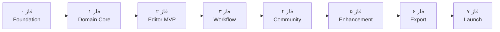
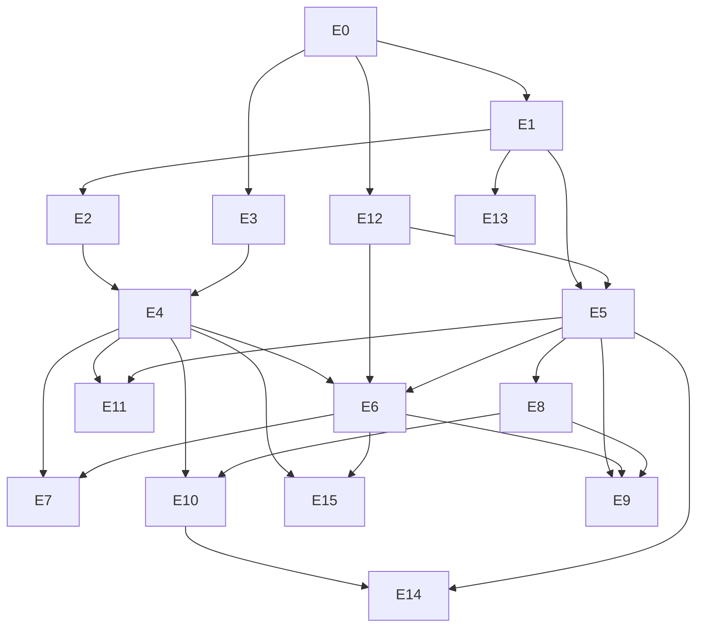

# اپیک‌ها و استوری‌ها — PKBL

> **نسخه:** 0.3  
> **مرجع:** [PRD](./prd.md) · [Architecture](./architecture.md) · [Progress](./progress.md)  
> **وضعیت:** برنامهٔ توسعه از صفر تا انتشار

---

## تصمیم‌های تأیید‌شده

| موضوع | تصمیم |
|--------|--------|
| **جهت امتیاز** | بالاتر = بهتر |
| **قالب پیش‌فرض** | ۶۰٪ ANSI مشخص (KLE subset — نه full spec) — [Appendix A](#appendix-a--قالب-۶۰-پیش‌فرض-kle) |
| **Custom corpus** | [جمع‌بندی در Appendix B](#appendix-b--جمع‌بندی-custom-corpus) |

---

## نمای کلی فازها



| فاز | اپیک‌ها | هدف |
|-----|---------|-----|
| ۰ | E0 | زیرساخت پروژه |
| ۱ | E1, E2, E3, E4 | هستهٔ دامنه (pure TS) |
| ۲ | E5, E6, E12, E15 | ویرایشگر + امتیاز live + فهم‌پذیری امتیاز |
| ۳ | E7, E8, E9 | corpus شخصی، ذخیره، مقایسه |
| ۴ | E10 | leaderboard و promotion |
| ۵ | E11 | پیشنهاد جایگذاری |
| ۶ | E13 | export OS |
| ۷ | E14 | polish و انتشار |

---

## E0 — Foundation & Dev Infrastructure

**هدف:** پروژه T3 آمادهٔ توسعه، تست و deploy باشد.  
**فاز:** ۰  
**وابستگی:** —  
**وضعیت:** ✅ انجام‌شده (۱۴۰۵/۰۴/۰۷)

### E0-S1 — Scaffold پروژه T3

**به‌عنوان** توسعه‌دهنده، **می‌خواهم** پروژه با T3 Stack راه‌اندازی شود **تا** توسعه type-safe شروع شود.

**معیار پذیرش:**
- [x] Next.js App Router + TypeScript strict
- [x] tRPC + Zod wired
- [x] Prisma + PostgreSQL (local dev)
- [x] Tailwind CSS
- [x] Vitest + Testing Library
- [x] ESLint/Prettier مطابق conventions پروژه
- [x] NextAuth **فعال نشده** (v1 بدون auth)

---

### E0-S2 — ساختار پوشه‌های دامنه

**به‌عنوان** توسعه‌دهنده، **می‌خواهم** ماژول‌های pure TS در `src/lib/` جدا از UI باشند **تا** تست و نگهداری ساده شود.

**معیار پذیرش:**
- [x] پوشه‌های `layout/`, `ergonomics/`, `corpus/`, `scoring/`, `leaderboard/`, `export/`
- [x] هیچ import از React در `src/lib/**`
- [x] alias path (`@/lib/...`) در tsconfig

---

### E0-S3 — CI و quality gates

**به‌عنوان** توسعه‌دهنده، **می‌خواهم** pipeline CI تست و lint اجرا کند **تا** regression زود catch شود.

**معیار پذیرش:**
- [x] GitHub Actions (یا equivalent): `lint`, `typecheck`, `test`
- [x] Coverage report برای `src/lib/**`
- [x] `.env.example` بدون secret

---

### E0-S4 — Seed دیتابیس و migration اولیه

**به‌عنوان** توسعه‌دهنده، **می‌خواهم** schema اولیه Prisma migrate شود **تا** leaderboard بعداً آماده باشد.

**معیار پذیرش:**
- [x] Models: `KeyboardTemplate`, `LayoutRecord`, `CorpusPreset`, `ScoreSnapshot`, `PromotionRecord`
- [x] `prisma db seed` قالب ۶۰٪ پیش‌فرض را insert کند
- [x] README با دستورات dev setup

---

## E1 — Layout Model & KLE (60% Template)

**هدف:** parse/serialize KLE، مدل layout با لایه base/shift، عملیات ویرایش immutable.  
**فاز:** ۱  
**وابستگی:** E0  
**وضعیت:** ✅ انجام‌شده (۱۴۰۵/۰۴/۰۷)

### E1-S1 — KLE parser برای subset ۶۰٪

**به‌عنوان** طراح صفحه‌کلید، **می‌خواهم** قالب KLE پیش‌فرض parse شود **تا** geometry و key slotها استخراج شوند.

**معیار پذیرش:**
- [x] Parse قالب Appendix A بدون خطا
- [x] پشتیبانی از `{w:N}`, `{a:N}`, `{w:N,h:M}` در scope موردنیاز
- [x] هر key دارای `keyId` پایدار (مثلاً ردیف-ستون)
- [x] لایهٔ shift از `\n` در label (مثلاً `"<\n,"`) استخراج شود
- [x] تست round-trip: parse → serialize → parse ≡

---

### E1-S2 — مدل Layout و EditableScope

**به‌عنوان** طراح، **می‌خواهم** فقط حروف فارسی و نمادهای رایج editable باشند **تا** scope v1 رعایت شود.

**معیار پذیرش:**
- [x] `Layout` شامل: `templateId`, `assignments`, `layers: base|shift`
- [x] `EditableScope` charset فارسی + نمادهای رایج تعریف شده
- [x] modifier keys (Ctrl, Shift, Tab, …) غیرeditable
- [x] spacebar editable (کاراکتر primary)
- [x] تفکیک `layout content` vs `scoring metadata`

---

### E1-S3 — عملیات assign و swap

**به‌عنوان** تایپ‌کننده، **می‌خواهم** کاراکتر را reassign یا swap کنم **تا** چیدمان را iterate کنم.

**معیار پذیرش:**
- [x] `assignChar(layout, keyId, layer, char)` — immutable
- [x] `swapKeys(layout, keyA, keyB, layer?)` — immutable
- [x] `resetKey`, `resetAllEditable`
- [x] assign کاراکتر خارج از charset → خطای validation
- [x] تست‌های unit برای همه عملیات

---

### E1-S4 — Serialize و import/export KLE

**به‌عنوان** طراح، **می‌خواهم** layout را به KLE export و از KLE import کنم **تا** چیدمان portable باشد.

**معیار پذیرش:**
- [x] `serializeKle(layout)` خروجی valid برای KLE editor
- [x] import layout کاربر (paste KLE) با validation
- [x] حفظ geometry اصلی template

---

### E1-S5 — تشخیص کاراکترهای بدون جایگاه

**به‌عنوان** تایپ‌کننده، **می‌خواهم** لیست کاراکترهای unassigned را ببینم **تا** چیدمان را کامل کنم.

**معیار پذیرش:**
- [x] `getUnassignedChars(layout, charset)` 
- [x] `getDuplicateAssignments(layout)` برای هشدار
- [x] `getCompletenessScore(layout)` — درصد پوشش charset

---

## E2 — Ergonomics Model (Touch Typing)

**هدف:** نگاشت فیزیکی کلید → finger/hand/row/penalty — مستقل از corpus.  
**فاز:** ۱  
**وابستگی:** E1  
**وضعیت:** ✅ انجام‌شده (۱۴۰۵/۰۴/۰۷)

**پیاده‌سازی:** `src/lib/ergonomics/` — `finger-map-60.json`, `metrics.ts`, `config.ts`; ادغام با `src/lib/scoring/config.ts`

### E2-S1 — Finger map قالب ۶۰٪

**به‌عنوان** طراح، **می‌خواهم** هر PhysicalKey به انگشت و دست نگاشت شود **تا** scorer ارگونومی دقیق باشد.

**معیار پذیرش:**
- [x] `finger-map-60.json` برای همه keyIdهای editable و غیرeditable
- [x] `Finger`: thumb|index|middle|ring|pinky
- [x] `Hand`: left|right
- [x] `Row`: home|top|bottom|number
- [x] تست: همه keyهای template پوشش داده شده

---

### E2-S2 — Reach penalty و weak key penalty

**به‌عنوان** طراح، **می‌خواهم** کلیدهای دشوار (مثل pinky/outer column) penalty داشته باشند **تا** scorer واقع‌گرایانه باشد.

**معیار پذیرش:**
- [x] `KeyMetrics` شامل `reachPenalty`, `weakKeyPenalty`
- [x] pinky keys penalty بالاتر
- [x] thumb keys (space) penalty جدا
- [x] config versioned در `ScoringConfig`

---

## E3 — Corpus Engine & Presets

**هدف:** نرمال‌سازی فارسی، n-gram extraction، presetهای wiki-fa و varzesh3.  
**فاز:** ۱  
**وابستگی:** E0

### E3-S1 — نرمال‌سازی متن فارسی

**به‌عنوان** طراح، **می‌خواهم** متن corpus قبل از تحلیل normalize شود **تا** نتایج با تایپ واقعی منطبق باشد.

**معیار پذیرش:**
- [x] یکسان‌سازی ی/ي، ک/ك، ة/ه (سیاست documented)
- [x] حذف zero-width غیرضروری
- [x] نرمال‌سازی فاصله و نیم‌فاصله
- [x] `normalizedVersion` string برای reproducibility
- [x] تست با fixtureهای فارسی (رسمی، محاوره، mixed numerals)

---

### E3-S2 — استخراج n-gram

**به‌عنوان** طراح، **می‌خواهم** unigram/bigram/trigram استخراج شود **تا** scorer فراتر از تک‌حرف عمل کند.

**معیار پذیرش:**
- [x] `extractNgrams(text)` → `NgramStats`
- [x] فقط کاراکترهای داخل charset هدف شمارش شوند
- [x] deterministic برای همان ورودی
- [x] تست edge cases: متن خالی، تک‌حرف، ZWNJ

---

### E3-S3 — Corpus build script

**به‌عنوان** توسعه‌دهنده، **می‌خواهم** از SQLite/JSONL موجود n-gram بسازم **تا** runtime سریع باشد.

**معیار پذیرش:**
- [x] `scripts/corpus-build.ts` از `corpus/wiki_fa.sqlite` و `corpus/varzesh3.sqlite`
- [x] خروجی: `packages/corpus-data/wiki-fa.ngrams.json`, `varzesh3.ngrams.json`
- [x] manifest با `corpusId`, `version`, `charCount`, `builtAt`
- [x] npm script: `corpus:build`

---

### E3-S4 — Corpus preset registry

**به‌عنوان** تایپ‌کننده، **می‌خواهم** presetها قابل انتخاب باشند **تا** برای use case مختلف بهینه کنم.

**معیار پذیرش:**
- [x] `CorpusPreset` type + `listPresets()`
- [x] presetهای `wiki-fa`, `varzesh3` با metadata (نام فارسی، توضیح، char count)
- [x] load precomputed artifact در server startup / import

---

## E4 — Scoring Engine

**هدف:** موتور deterministic امتیازدهی با breakdown کامل — higher is better.  
**فاز:** ۱  
**وابستگی:** E1, E2, E3  
**وضعیت:** ✅ انجام‌شده (۱۴۰۵/۰۴/۰۷)

**پیاده‌سازی:** `src/lib/scoring/` — `compute-score.ts`, `char-lookup.ts`, `config.ts`, `types.ts`, `fixtures/golden.ts`

**یادداشت review:** `rowSwitching` = `bigramRowSwitching` + `trigramRowSwitching` (تفکیک‌شده برای UI).

### E4-S1 — هستهٔ scorer

**به‌عنوان** تایپ‌کننده، **می‌خواهم** layout روی corpus امتیاز بگیرد **تا** چیدمان را عینی مقایسه کنم.

**معیار پذیرش:**
- [x] `computeScore(layout, ngramStats, config)` pure function
- [x] resolve char → key (+ shift layer) via `buildCharLookup` / `resolveChar`
- [x] **امتیاز بالاتر = بهتر** (`baseScore` − normalized costs)
- [x] `scorerVersion` در خروجی
- [x] deterministic: golden test با fixture (`965.51…` pinned)

---

### E4-S2 — سیگنال‌های unigram

**به‌عنوان** تایپ‌کننده، **می‌خواهم** هزینهٔ تک‌حرف‌ها در امتیاز لحاظ شود **تا** حروف پرتکرار در جای خوب پاداش بگیرند.

**معیار پذیرش:**
- [x] unigram cost بر اساس `reachPenalty` + `weakKeyPenalty` (از E2)
- [x] سهم unigram در `breakdown.unigramScore`
- [x] `hotspots`: پرهزینه‌ترین حروف (top N، پیش‌فرض ۱۰)

---

### E4-S3 — سیگنال‌های bigram

**به‌عنوان** تایپ‌کننده، **می‌خواهم** bigramها ارزیابی شوند **تا** توالی‌های بد catch شوند.

**معیار پذیرش:**
- [x] same-finger bigram penalty
- [x] same-hand bigram penalty
- [x] hand alternation bonus
- [x] `breakdown.sameFingerBigrams`, `sameHandBigrams`, `handAlternation`

---

### E4-S4 — سیگنال‌های trigram

**به‌عنوان** تایپ‌کننده، **می‌خواهم** trigram هم لحاظ شود **تا** الگوهای سه‌حرفی فارسی پوشش داده شود.

**معیار پذیرش:**
- [x] trigram transition cost (جمع دو bigram transition)
- [x] row switching penalty در توالی‌ها
- [x] `breakdown.trigramScore`, `rowSwitching`

---

### E4-S5 — متریک‌های ارگونومی aggregate

**به‌عنوان** تایپ‌کننده، **می‌خواهم** home row usage، finger load و hand balance را ببینم **تا** تعادل چیدمان را بفهمم.

**معیار پذیرش:**
- [x] `homeRowUsage` — درصد weighted (۰–۱۰۰)
- [x] `fingerLoad` — per finger (نرمال‌شده، مجموع ≈ ۱)
- [x] `handBalance` — ۰–۱ (۱ = متعادل)
- [x] `weakKeyPenalty` aggregate (فقط کلیدهای assigned)
- [x] همه در `ScoreResult.breakdown`

---

### E4-S6 — ScoringConfig versioned

**به‌عنوان** طراح، **می‌خواهم** weights قابل version باشند **تا** ranking قدیمی قابل reproduce باشد.

**معیار پذیرش:**
- [x] `ScoringConfig` با weights documented (`SCORING_WEIGHTS_V1`)
- [x] version string (`scorerVersion: "1.0.0"`, `version: 1`)
- [x] تست: تغییر weight → تغییر predictable در score

---

## E5 — Editor UI (Keyboard-Centric)

**هدف:** ویرایشگر تعاملی صفحه‌کلید — drag, click, layer toggle.  
**فاز:** ۲  
**وابستگی:** E1, E12

### E5-S1 — رندر بصری صفحه‌کلید ۶۰٪

**به‌عنوان** تایپ‌کننده، **می‌خواهم** صفحه‌کلید را ببینم **تا** چیدمان را درک کنم.

**معیار پذیرش:**
- [x] SVG/HTML keyboard از template geometry
- [x] نسبت‌ها و spacing مطابق KLE
- [x] نمایش label base (و shift در hover/layer mode)
- [x] responsive برای desktop (نه mobile-first)
- [x] RTL-friendly UI shell

---

### E5-S2 — انتخاب لایه base/shift

**به‌عنوان** تایپ‌کننده، **می‌خواهم** بین لایه base و shift جابه‌جا شوم **تا** نمادها را هم بچینم.

**معیار پذیرش:**
- [x] toggle یا tab: Base | Shift
- [x] visual distinction (رنگ/بج)
- [x] state در editor store

---

### E5-S3 — Click-to-assign

**به‌عنوان** تایپ‌کننده، **می‌خواهم** روی کلید کلیک و کاراکتر انتخاب کنم **تا** بدون drag هم ویرایش کنم.

**معیار پذیرش:**
- [x] click key → palette/popover کاراکتر
- [x] فقط editable keys
- [x] فقط charset مجاز
- [x] feedback فوری روی keycap

---

### E5-S4 — Drag-and-drop assign

**به‌عنوان** تایپ‌کننده، **می‌خواهم** کاراکتر را بکشم روی کلید **تا** سریع چیدمان کنم.

**معیار پذیرش:**
- [x] drag از character palette
- [x] drop روی key → assign
- [x] drag key→key → swap
- [x] `@dnd-kit/core` یا equivalent

---

### E5-S5 — Character palette

**به‌عنوان** تایپ‌کننده، **می‌خواهم** حروف فارسی و نمادها را ببینم **تا** انتخاب کنم.

**معیار پذیرش:**
- [x] همه charset v1 نمایش داده شود
- [x] assigned vs unassigned visual state
- [x] کلیک → حالت assign روی key انتخاب‌شده

---

### E5-S6 — Reset و عملیات سریع

**به‌عنوان** تایپ‌کننده، **می‌خواهم** کلید یا کل صفحه را reset کنم **تا** iterate سریع باشد.

**معیار پذیرش:**
- [x] reset single key
- [x] reset all editable keys
- [x] undo/redo (حداقل ۲۰ step) — optional اما توصیه‌شده
- [x] confirm برای reset all

---

## E6 — Score Analytics Panel

**هدف:** نمایش live score، breakdown، hotspots — هم‌زمان با ویرایش.  
**فاز:** ۲  
**وابستگی:** E4, E5, E12  
**طراحی UI:** [editor-analytics-layout.md](./editor-analytics-layout.md)

### E6-S1 — Live score با debounce

**به‌عنوان** تایپ‌کننده، **می‌خواهم** امتیاز با تغییر layout به‌روز شود **تا** feedback فوری داشته باشم.

**معیار پذیرش:**
- [x] debounce ~100–150ms
- [x] امتیاز کلی prominent — **بالاتر بهتر**
- [x] loading state بدون flicker
- [x] preset selector (wiki-fa / varzesh3)

---

### E6-S2 — Breakdown panel

**به‌عنوان** تایپ‌کننده، **می‌خواهم** جزئیات امتیاز را ببینم **تا** بفهمم چرا این عدد به دست آمده.

**معیار پذیرش:**
- [x] نمایش: unigram, bigram, trigram scores
- [x] home row %, hand balance
- [x] same-finger / same-hand bigram counts
- [x] row switching metric
- [x] weak key penalty

---

### E6-S3 — Hotspots visualization

**به‌عنوان** تایپ‌کننده، **می‌خواهم** پرهزینه‌ترین حروف را ببینم **تا** اول آن‌ها را جابه‌جا کنم.

**معیار پذیرش:**
- [x] ranked list یا heat overlay روی keyboard
- [x] top 10 hotspots
- [x] link hotspot → key روی keyboard

---

### E6-S4 — Ranking hint (توضیح انسانی)

**به‌عنوان** تایپ‌کننده، **می‌خواهم** یک جملهٔ توضیحی ببینم **تا** quickly بفهمم وضعیت چیدمان.

**معیار پذیرش:**
- [x] template-based hints از breakdown (مثلاً «بار انگشت کوچک بالاست»)
- [x] فارسی، concise
- [x] بدون LLM در v1

---

## E7 — Custom Corpus

**هدف:** paste متن کاربر و امتیازدهی شخصی‌سازی‌شده.  
**فاز:** ۳  
**وابستگی:** E3, E4, E6

### E7-S1 — UI paste corpus

**به‌عنوان** تایپ‌کننده، **می‌خواهم** متن خودم را paste کنم **تا** امتیازدهی با کاربردم هم‌خوان باشد.

**معیار پذیرش:**
- [ ] textarea با placeholder راهنما
- [ ] انتخاب preset «متن من»
- [ ] نمایش char count
- [ ] هشدار در ۵۰KB، reject در ۱۰۰KB

---

### E7-S2 — پردازش client-side n-gram (ماژول مشترک)

**به‌عنوان** تایپ‌کننده، **می‌خواهم** بعد از paste امتیاز سریع به‌روز شود **تا** تجربه interactive حفظ شود.

**معیار پذیرش:**
- [ ] همان `corpus` module در client (shared bundle)
- [ ] `extractNgrams` در Web Worker برای متن >10KB (optional perf)
- [ ] cache با hash(normalizedText + version)
- [ ] latency < 500ms برای 50KB

---

### E7-S3 — اعتبارسنجی server در submit

**به‌عنوان** سیستم، **می‌خواهم** در leaderboard submit corpus custom re-validate شود **تا** consistency حفظ شود.

**معیار پذیرش:**
- [ ] submit شامل `customTextHash` یا متن
- [ ] server n-gram recompute و score verify
- [ ] reject اگر score mismatch (tolerance 0.01%)

---

## E8 — Local Persistence & Layout Management

**هدف:** ذخیره draft بدون auth، باز کردن layout قبلی.  
**فاز:** ۳  
**وابستگی:** E1, E5

### E8-S1 — Auto-save draft

**به‌عنوان** تایپ‌کننده، **می‌خواهم** layout من auto-save شود **تا** کارم گم نشود.

**معیار پذیرش:**
- [x] localStorage/IndexedDB
- [x] save: layout state + corpus preset + timestamp
- [x] restore در load صفحه

---

### E8-S2 — مدیریت چند layout محلی

**به‌عنوان** تایپ‌کننده، **می‌خواهم** چند layout ذخیره و rename کنم **تا** روی چند کاندید کار کنم.

**معیار پذیرش:**
- [ ] list layouts محلی
- [ ] create / rename / delete / duplicate
- [ ] load layout → editor

---

### E8-S3 — Export/import KLE file

**به‌عنوان** تایپ‌کننده، **می‌خواهم** layout را به فایل KLE export/import کنم **تا** خارج از app هم داشته باشم.

**معیار پذیرش:**
- [ ] download `.kle` یا JSON
- [ ] upload/import
- [ ] validation error messages فارسی

---

## E9 — Compare Layouts

**هدف:** مقایسه side-by-side چند کاندید.  
**فاز:** ۳  
**وابستگی:** E5, E6

### E9-S1 — Compare mode دو layout

**به‌عنوان** تایپ‌کننده، **می‌خواهم** دو layout کنار هم ببینم **تا** بهترین را انتخاب کنم.

**معیار پذیرش:**
- [ ] انتخاب layout A و B (local یا template)
- [ ] دو keyboard + دو score panel
- [ ] highlight تفاوت keys

---

### E9-S2 — Comparison summary table

**به‌عنوان** تایپ‌کننده، **می‌خواهم** جدول مقایسه breakdown ببینم **تا** quickly برنده را بشناسم.

**معیار پذیرش:**
- [ ] جدول metric × layout
- [ ] winner indicator per metric
- [ ] overall winner (score بالاتر)

---

## E10 — Leaderboard & Template Promotion

**هدف:** ranking، submit بدون auth، auto-promotion به template.  
**فاز:** ۴  
**وابستگی:** E4, E8, E12

### E10-S1 — Submit layout به leaderboard

**به‌عنوان** علاقه‌مند، **می‌خواهم** layout را submit کنم **تا** در ranking ثبت شود.

**معیار پذیرش:**
- [ ] بدون login
- [ ] alias اختیاری
- [ ] fingerprint dedup
- [ ] score + corpus preset + layout ذخیره
- [ ] rate limit (مثلاً ۵ submit / ساعت / IP)

---

### E10-S2 — Leaderboard list

**به‌عنوان** علاقه‌مند، **می‌خواهم** برترین layoutها را ببینم **تا** ایده بگیرم.

**معیار پذیرش:**
- [ ] sort by score desc (بالاتر بهتر)
- [ ] filter by corpus preset
- [ ] pagination
- [ ] نمایش: rank, alias, score, date

---

### E10-S3 — Notification شکست رکورد

**به‌عنوان** تایپ‌کننده، **می‌خواهم** وقتی رکورد را شکستم مطلع شوم **تا** بدانم ارزش submit دارد.

**معیار پذیرش:**
- [ ] pre-submit preview: «این layout از رتبه ۱ بهتر است»
- [ ] post-submit celebration UI
- [ ] اگر reject: دلیل (امتیاز پایین‌تر، duplicate)

---

### E10-S4 — Auto-promotion به template

**به‌عنوان** علاقه‌مند، **می‌خواهم** layoutهای برتر به template ارتقا یابند **تا** دیگران استفاده کنند.

**معیار پذیرش:**
- [ ] rule: score > threshold OR rank #1 for preset
- [ ] `PromotionRecord` + `KeyboardTemplate.isCommunity`
- [ ] template در gallery قابل load
- [ ] تست promotion rules

---

### E10-S5 — Load community template

**به‌عنوان** تایپ‌کننده، **می‌خواهم** template جامعه را load کنم **تا** از آن شروع کنم.

**معیار پذیرش:**
- [ ] templates page / gallery
- [ ] preview score
- [ ] «شروع از این template» → editor

---

## E11 — Character Placement Suggestions

**هدف:** پیشنهاد جایگذاری برای کاراکترهای unassigned.  
**فاز:** ۵  
**وابستگی:** E4, E5

### E11-S1 — Suggest best key for char

**به‌عنوان** تایپ‌کننده، **می‌خواهم** برای هر حرف unassigned بهترین key پیشنهاد شود **تا** سریع کامل کنم.

**معیار پذیرش:**
- [ ] `suggestPlacements(layout, unassigned[], corpus)`
- [ ] heuristic: کمترین افزایش cost / بیشترین gain score
- [ ] top 3 suggestion per char

---

### E11-S2 — Auto-fill suggestion (با confirm)

**به‌عنوان** تایپ‌کننده، **می‌خواهم** یک کلیک همه unassigned را پر کند **تا** starting point داشته باشم.

**معیار پذیرش:**
- [ ] دکمه «پیشنهاد خودکار»
- [ ] preview diff قبل از apply
- [ ] confirm/cancel

---

## E12 — API Layer & Server Integration

**هدف:** tRPC routers، wiring server ↔ domain modules.  
**فاز:** ۲ (موازی با E5/E6)  
**وابستگی:** E0, E3, E4

### E12-S1 — tRPC score router

**معیار پذیرش:**
- [ ] `score.evaluate`, `score.compare`
- [ ] Zod input validation
- [ ] ApiResult envelope

---

### E12-S2 — tRPC layout router

**معیار پذیرش:**
- [ ] `layout.getDefaultTemplate`, `layout.parseKle`, `layout.serialize`
- [ ] `layout.suggestPlacements` (stub تا E11)

---

### E12-S3 — tRPC corpus router

**معیار پذیرش:**
- [ ] `corpus.listPresets`
- [ ] `corpus.analyzeCustom` (fallback server-side)

---

### E12-S4 — tRPC leaderboard router

**معیار پذیرش:**
- [ ] `leaderboard.list`, `submit`, `templates`
- [ ] Prisma integration

---

## E13 — Export Pipeline (OS Install)

**هدف:** تبدیل layout به artifact نصب‌پذیر — فاز بعد MVP.  
**فاز:** ۶  
**وابستگی:** E1

### E13-S1 — Export IR (Intermediate Representation)

**معیار پذیرش:**
- [ ] `Layout` → `ExportIR` (platform-agnostic)
- [ ] شامل base + shift mappings
- [ ] تست golden IR

---

### E13-S2 — Windows export (.klc / MSKLC)

**معیار پذیرش:**
- [ ] generate valid KLC یا راهنمای MSKLC
- [ ] download bundle
- [ ] README نصب فارسی

---

### E13-S3 — macOS export (.keylayout)

**معیار پذیرش:**
- [ ] XML keylayout valid
- [ ] install instructions

---

### E13-S4 — Linux XKB export

**معیار پذیرش:**
- [ ] XKB symbols file
- [ ] install instructions

---

## E14 — Polish, Performance & Launch

**هدف:** production-ready، deploy، monitoring.  
**فاز:** ۷  
**وابستگی:** همهٔ اپیک‌های MVP (E0–E10)

### E14-S1 — Performance audit

**معیار پذیرش:**
- [ ] score < 200ms برای presets
- [ ] Lighthouse performance > 85 (desktop)
- [ ] bundle size review

---

### E14-S2 — Accessibility pass

**معیار پذیرش:**
- [ ] keyboard navigation در editor
- [ ] ARIA labels
- [ ] contrast check

---

### E14-S3 — Error handling & empty states

**معیار پذیرش:**
- [ ] error boundaries
- [ ] friendly فارسی messages
- [ ] empty leaderboard/template states

---

### E14-S4 — Production deploy

**معیار پذیرش:**
- [ ] Vercel + Neon/Supabase (یا Docker)
- [ ] env vars documented
- [ ] health check endpoint

---

### E14-S5 — Landing & onboarding

**معیار پذیرش:**
- [ ] صفحهٔ intro: «آزمایشگاه چیدمان فارسی»
- [ ] quick tour (۳ step)
- [ ] link به docs

---

### E14-S6 — E2E smoke tests

**معیار پذیرش:**
- [ ] Playwright: load → assign → score → submit flow
- [ ] CI integration

---

## E15 — Score Comprehension UX (فهم‌پذیری امتیاز)

**هدف:** تبدیل پنل Analytics از «نمایش عدد و متریک خام» به یک تجربهٔ **قابل‌فهم برای کاربر غیرمتخصص** — کسی که پیش‌زمینهٔ keyboard layout / ارگونومی / NLP ندارد. کاربر باید در یک نگاه بفهمد «چیدمانم خوب است یا بد؟» و در نگاه دوم بفهمد «چرا؟ و چه چیزی را اصلاح کنم؟».

**فاز:** ۲ (refinement — بعد از E6؛ وابستگی‌های فنی از قبل ✅ آماده‌اند)

**وابستگی:** E4 (Scoring Engine)، E6 (Score Analytics Panel)

**رابطه با اپیک‌های دیگر:**
- **E6 را extend/refine می‌کند، جایگزین نمی‌کند.** کامپوننت‌های E6 (`score-hero`, `breakdown-accordion`, `hotspot-list`, `ranking-hint`) باقی می‌مانند و زیر «نمای متخصص» قرار می‌گیرند.
- **به `ScoreResult`/`ScoreBreakdown` از E4 دست نمی‌زند.** همهٔ بینش‌ها (insights) از روی همان خروجی موجود scorer مشتق می‌شوند؛ هیچ تغییری در منطق امتیازدهی یا `scorerVersion` لازم نیست.
- با **E9 (Compare)** هم‌افزایی دارد: منطق baseline-compare در E15-S4 می‌تواند بعداً در E9 بازاستفاده شود.
- مکمل **E14-S5 (onboarding)** است اما مستقل از آن.

**طراحی UI:** [score-comprehension-ux.md](./score-comprehension-ux.md)

**وضعیت:** ✅ complete (۷/۷)

**اصل راهنما:** «از عدد به قضاوت، از قضاوت به اقدام» — کاربر لِی هیچ‌گاه نباید با `unigramCost = 412.7` تنها بماند؛ هر متریک خام باید به یک برچسب کیفی (خوب/متوسط/ضعیف)، یک توضیح ساده، و یک پیشنهاد اقدام نگاشت شود.

---

### E15-S1 — قضاوت کلی با گیج کیفی (Verdict Gauge)

**به‌عنوان** کاربر بدون تخصص، **می‌خواهم** به‌جای عدد خام، یک سنجهٔ بصری «خوب / متوسط / ضعیف» ببینم **تا** بدون دانستن مقیاس امتیاز بفهمم چیدمانم در چه وضعی است.

**معیار پذیرش:**
- [ ] گیج/نوار رنگی (radial یا horizontal) با سه باند رنگی: ضعیف (amber/red)، متوسط (yellow)، خوب (emerald) — هماهنگ با palette موجود (`slate-900/950`, accent `sky`).
- [ ] برچسب کیفی فارسی بزرگ و prominent (مثلاً «چیدمان خوب»، «قابل‌قبول»، «نیازمند بهبود») کنار عدد خام.
- [ ] باندها **نسبت به baseline** تعریف شوند، نه absolute (چون total خام بی‌معناست): مرجع = امتیاز چیدمان پیش‌فرض ۶۰٪ روی همان preset + سقف heuristic از golden fixture. ثابت‌ها در `src/lib/scoring/insights/metric-bands.ts`.
- [ ] عدد خام همچنان نمایش داده شود اما secondary (`text-slate-500`, کوچک‌تر) — برای کاربر متخصص.
- [ ] `aria-live="polite"` فقط روی تغییر برچسب کیفی (نه روی هر تغییر عدد).
- [ ] تست واحد: نگاشت total → band برای ورودی‌های مرزی deterministic باشد.

---

### E15-S2 — کارت‌های قوت‌ها و ضعف‌ها (Strengths / Weaknesses)

**به‌عنوان** کاربر بدون تخصص، **می‌خواهم** فهرستی کوتاه از «چه چیزی خوب است» و «چه چیزی بد است» با زبان ساده ببینم **تا** بفهمم *چرا* این امتیاز را گرفته‌ام (PRD خط ۶۲ و ۱۴۴).

**معیار پذیرش:**
- [ ] تابع pure `deriveInsights(breakdown, baseline)` در `src/lib/scoring/insights/derive-insights.ts` که آرایه‌ای از `Insight { kind: 'strength'|'weakness', metric, severity, titleFa, adviceFa }` برمی‌گرداند.
- [ ] هر متریک ارگونومی (homeRowUsage, handBalance, sameFingerBigrams, weakKeyPenalty, rowSwitching) به آستانه‌های good/ok/poor نگاشت شود (از `metric-bands.ts`).
- [ ] حداکثر ۳ قوت و ۳ ضعف برتر نمایش داده شود (بر اساس severity).
- [ ] هر کارت: آیکن وضعیت + عنوان فارسی ساده + یک جملهٔ توصیه (مثلاً «انگشت کوچک بیش از حد بار دارد — حروف پرتکرار را به انگشتان قوی‌تر منتقل کنید»).
- [ ] حالت empty: اگر چیدمان ناقص است، پیام «اول چیدمان را کامل کنید».
- [ ] تست واحد: fixtureهای breakdown → insightهای موردانتظار.

---

### E15-S3 — واژه‌نامهٔ متریک‌ها: آیکن (i) + popover و بخش راهنما

**به‌عنوان** کاربر بدون تخصص، **می‌خواهم** با hover/کلیک روی آیکن (i) کنار هر متریک، توضیح ساده‌ای از معنای آن ببینم **تا** بدانم n-gram / بی‌گرام / ردیف home یعنی چه.

**معیار پذیرش:**
- [ ] کامپوننت `MetricInfo` (آیکن i + popover/tooltip) قابل‌استفادهٔ مجدد، با محتوای فارسی ساده و بدون ژارگون.
- [ ] واژه‌نامهٔ متمرکز در `metric-glossary.ts`: تعریف هر اصطلاح + (اختیاری) یک مثال (مثلاً «بی‌گرام = دو حرف پشت‌سرهم، مثل ‹سل› در ‹سلام›»).
- [ ] یک بخش راهنمای جمع‌وجور (collapsible «راهنمای امتیاز» یا modal) که همهٔ مفاهیم را یک‌جا توضیح دهد.
- [ ] دسترس‌پذیری: popover با کیبورد باز/بسته شود (`aria-describedby`, `Esc` برای بستن)، روی موبایل با tap.
- [ ] هیچ متن خامِ فنی بدون آیکن توضیح در UI لِی باقی نماند.

---

### E15-S4 — مقایسه با خط مبنا (چیدمان پیش‌فرض ۶۰٪)

**به‌عنوان** کاربر بدون تخصص، **می‌خواهم** ببینم چیدمانم نسبت به چیدمان پیش‌فرض چقدر بهتر/بدتر است **تا** بدون درک مقیاس مطلق، پیشرفت را حس کنم.

**معیار پذیرش:**
- [ ] محاسبهٔ امتیاز چیدمان پیش‌فرض ۶۰٪ روی preset جاری (cache‌شده per preset) در `src/lib/scoring/insights/baseline.ts`.
- [ ] نمایش delta نسبی: «‪+۱۸٪‬ بهتر از چیدمان پیش‌فرض» با رنگ سبز/قرمز.
- [ ] نوار مقایسه‌ای کوچک (دو میله: شما vs پیش‌فرض).
- [ ] منطق baseline طوری نوشته شود که در E9 (Compare) بازاستفاده شود (تابع pure مستقل از UI).
- [ ] تست واحد: delta برای چیدمان بهتر مثبت، برای بدتر منفی.

---

### E15-S5 — نمایش بصری بار انگشتان و تعادل دست‌ها

**به‌عنوان** کاربر بدون تخصص، **می‌خواهم** توزیع بار روی انگشت‌ها و تعادل دو دست را به‌صورت نمودار رنگی ببینم **تا** به‌جای خواندن اعداد، در یک نگاه نامتعادلی را تشخیص دهم.

**معیار پذیرش:**
- [ ] نمودار بار انگشت رنگ‌کدشده (سبز = متعادل، قرمز = بیش‌بار) بر اساس `fingerLoad: Record<Finger, number>` — ارتقای `finger-load-bars.tsx`.
- [ ] نشانگر بصری تعادل دست (مثلاً نوار دوسویه چپ/راست) برای `handBalance`، با برچسب کیفی.
- [ ] آستانهٔ «بیش‌بار» برای هر انگشت از `metric-bands.ts` (انگشت کوچک آستانهٔ پایین‌تر).
- [ ] برچسب‌های فارسی انگشتان از `analytics-labels.ts` موجود بازاستفاده شوند.
- [ ] بدون وابستگی سنگین چارت؛ SVG/`div` ساده کافی است (هماهنگ با اصل مینیمال E6).

---

### E15-S6 — Delta امتیاز پس از هر ویرایش

**به‌عنوان** کاربر بدون تخصص، **می‌خواهم** بعد از هر تغییر کلید ببینم امتیاز چقدر بالا/پایین رفت **تا** بازخورد فوری بگیرم که حرکتم خوب بود یا بد.

**معیار پذیرش:**
- [ ] نگه‌داری امتیاز قبلی و نمایش badge گذرا «‪+۱۲‬» (سبز) یا «‪−۸‬» (قرمز) پس از هر ویرایش پایدار.
- [ ] انیمیشن ملایم (بدون شمارندهٔ سنگین)؛ پس از ~۲ ثانیه محو شود.
- [ ] با debounce موجود `useLiveScore` (۱۲۰ms) هماهنگ باشد — delta فقط روی نتیجهٔ نهایی، نه حالت stale.
- [ ] حالت اول (بدون امتیاز قبلی) badge نمایش ندهد.

---

### E15-S7 — تفکیک «نمای ساده» و «نمای متخصص» + پنهان‌سازی متریک‌های debug

**به‌عنوان** کاربر بدون تخصص، **می‌خواهم** به‌طور پیش‌فرض فقط اطلاعات قابل‌فهم ببینم و متریک‌های فنی پنهان باشند **تا** پنل شلوغ و گیج‌کننده نباشد.

**معیار پذیرش:**
- [ ] toggle «نمای ساده | نمای متخصص» در بالای پنل؛ پیش‌فرض = ساده.
- [ ] **نمای ساده:** Verdict gauge (S1) + قوت‌ها/ضعف‌ها (S2) + baseline (S4) + نمودار بار انگشت (S5) + hotspots با زبان ساده.
- [ ] **نمای متخصص:** کل breakdown accordion موجود E6 شامل `unigramCost` و دیگر اعداد خام.
- [ ] متریک‌های صرفاً debug (مثل `unigramCost`, `bigramCost`, `trigramCost` خام) فقط در نمای متخصص.
- [ ] وضعیت toggle در `localStorage` (`pkbl-analytics-view-mode`) ذخیره شود.
- [ ] هیچ قابلیت موجود E6 حذف نشود — فقط زیر نمای متخصص جابه‌جا شود.

---

#### Testing Strategy (E15)

- **Unit (lib، هدف ۸۰٪+):** `metric-bands.ts` (نگاشت آستانه)، `derive-insights.ts` (breakdown → insights)، `baseline.ts` (delta)، `verdict.ts` (total → band).
- **Component:** رندر verdict band درست برای total مرزی؛ باز/بسته‌شدن popover؛ toggle نمای ساده/متخصص.
- **Integration:** تغییر کلید → به‌روزرسانی verdict + delta badge؛ تعویض preset → بازمحاسبهٔ baseline.
- **A11y:** ناوبری کیبوردی popover، `aria-live` فقط روی verdict.

#### Risks & Mitigations (E15)

- **ریسک:** آستانه‌های good/ok/poor دلخواه و غیرواقعی باشند.
  - **کاهش:** baseline-relative + p-valueهای موجود `ranking-hints.ts`؛ ثابت‌ها versioned و قابل tune.
- **ریسک:** درهم‌ریختگی با E6.
  - **کاهش:** نمای متخصص = E6 دست‌نخورده؛ E15 فقط لایهٔ روی آن.
- **ریسک:** baseline دوبار محاسبه و افت perf.
  - **کاهش:** cache per preset (baseline ثابت است).

#### Success Criteria (E15)

- [ ] کاربر بدون تخصص بدون خواندن عدد خام بفهمد چیدمانش خوب/بد است.
- [ ] هر متریک یک توضیح ساده (i) دارد.
- [ ] قوت‌ها و ضعف‌ها با توصیهٔ اقدام نمایش داده می‌شوند.
- [ ] مقایسه با پیش‌فرض و delta هر ویرایش کار می‌کند.
- [ ] هیچ قابلیت E6 از بین نرفته (نمای متخصص).
- [ ] پوشش تست ماژول‌های pure جدید ۸۰٪+.

---

## وابستگی‌های بین اپیک‌ها



---

## اولویت MVP (Minimum Shippable)

برای **اولین انتشار عمومی**، این استوری‌ها block هستند:

| # | استوری | اپیک |
|---|--------|------|
| 1 | E0-S1, E0-S2, E0-S4 | Foundation |
| 2 | E1-S1 → S3 | Layout |
| 3 | E2-S1, E2-S2 | Ergonomics |
| 4 | E3-S1 → S4 | Corpus |
| 5 | E4-S1 → S5 | Scoring |
| 6 | E12-S1, S3 | API |
| 7 | E5-S1 → S5 | Editor |
| 8 | E6-S1, S2, S3 | Analytics |
| 9 | E8-S1 | Local save |
| 10 | E10-S1, S2 | Leaderboard |

**بعد از MVP:** E7, E9, E10-S3/S4/S5, E11, E13, E14

---

## Appendix A — قالب ۶۰٪ پیش‌فرض (KLE)

```javascript
// Default 60% ANSI — seed template
[
  ["~\n`","!\n1","@\n2","#\n3","$\n4","%\n5","^\n6","&\n7","*\n8","(\n9",")\n0","_\n-","+\n=",{w:2},"Backspace"],
  [{w:1.5},"Tab","Q","W","E","R","T","Y","U","I","O","P","{\n[","}\n]",{w:1.5},"|\n\\"],
  [{w:1.75},"Caps Lock","A","S","D","F","G","H","J","K","L",":\n;","\"\n'",{w:2.25},"Enter"],
  [{w:2.25},"Shift","Z","X","C","V","B","N","M","<\n,",">\n.","?\n/",{w:2.75},"Shift"],
  [{w:1.25},"Ctrl",{w:1.25},"Win",{w:1.25},"Alt",{a:7,w:6.25},"",{a:4,w:1.25},"Alt",{w:1.25},"Win",{w:1.25},"Menu",{w:1.25},"Ctrl"]
]
```

**نکات پیاده‌سازی:**
- فقط syntax موردنیاز این template parse شود (KLE subset)
- spacebar = `{a:7,w:6.25},""` در ردیف پایین
- editable keys: حروف و نمادهای فارسی روی QWERTY positions
- modifier keys: غیرeditable در v1

---

## Appendix B — جمع‌بندی Custom Corpus

### مسئله

کاربر متن خودش را paste می‌کند. باید balance بین **interactive latency**، **determinism** و **امنیت leaderboard** برقرار شود.

### گزینه‌های بررسی‌شده

| گزینه | مزیت | عیب |
|-------|------|-----|
| فقط server | یک pipeline، rate limit آسان | latency بالا؛ هر تغییر متن = round trip |
| فقط client | سریع‌ترین UX | احتمال inconsistency؛ leaderboard قابل gaming |
| **Hybrid (انتخاب‌شده)** | UX سریع + determinism + verify در submit | کمی پیچیدگی bundle |

### تصمیم نهایی: **Hybrid — ماژول مشترک client/server**

1. **Preset corpora** (`wiki-fa`, `varzesh3`): n-gram ازپیش‌محاسبه‌شده در build؛ بدون runtime parse.
2. **Custom paste**: همان `src/lib/corpus` در **browser** اجرا می‌شود → n-gram فوری، بدون round trip.
3. **Cache**: hash(`normalizedText` + `normalizedVersion`) → avoid recompute.
4. **محدودیت حجم**: هشدار در **۵۰KB**؛ hard reject در **۱۰۰KB** (≈ ۵۰–۱۰۰ پاراگراف — برای typing corpus کافی است).
5. **Web Worker** (optional): برای متن >10KB تا UI block نشود.
6. **Leaderboard submit**: server متن/hash را recompute می‌کند و score را verify می‌کند (tolerance 0.01%).
7. **Fallback API** (`corpus.analyzeCustom`): اگر client module fail کرد، server-side backup.

**دلیل:** scoring در حین ویرایش باید real-time باشد (PRD + architecture NFR). pure TS module در هر دو محیط deterministic است و تست‌های unit همان code path را پوشش می‌دهند.

---

## Changelog

| نسخه | تاریخ | تغییر |
|------|-------|-------|
| 0.3 | ۱۴۰۵/۰۴/۰۹ | افزودن E15 Score Comprehension UX (۷ استوری) |
| 0.2 | ۱۴۰۵/۰۴/۰۷ | علامت‌گذاری E0–E2 به‌عنوان انجام‌شده؛ جزئیات پیاده‌سازی E2 |
| 0.1 | ۱۴۰۵/۰۴/۰۷ | نسخهٔ اول — epics E0–E14 |
