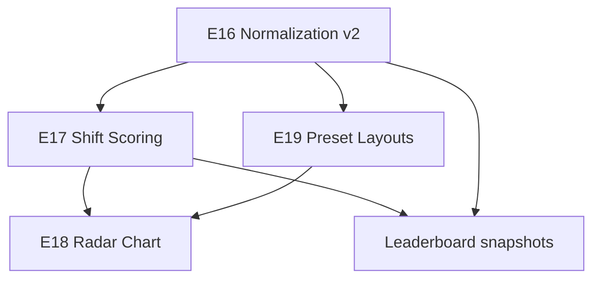

# برنامهٔ توسعه — وفاداری layout، شیفت، نمودار رادار، و presetها

> **نسخه:** 0.1  
> **تاریخ:** ۱۴۰۵/۰۴/۱۰  
> **وضعیت:** برنامه‌ریزی — پیاده‌سازی شروع نشده  
> **مرجع:** [epics E16–E19](../epics.md) · [architecture §5.3–5.4](../architecture.md)

---

## خلاصهٔ اجرایی

چهار محور مستقل اما مرتبط شناسایی شد:

| # | محور | مشکل فعلی | خروجی هدف |
|---|------|-----------|-----------|
| 1 | **نرمال‌سازی corpus** | برخی variantها اشتباه یکی می‌شوند؛ اعداد برعکس نرمال می‌شوند | `fa-normalize-v2` + rebuild artifactها |
| 2 | **امتیاز شیفت** | لایهٔ shift در lookup هست ولی در breakdown/امتیاز لحاظ نمی‌شود | متریک `shiftLayerUsage` + penalty/bonus در scorer v2 |
| 3 | **نمودار رادار** | فقط bar chart و delta خطی (E15) | spider chart: layout فعلی vs فارسی استاندارد |
| 4 | **preset layout** | فقط `persian-standard-60` به‌عنوان default | dropdown + حداقل «فارسی قدیمی Windows» |

**ترتیب پیشنهادی پیاده‌سازی:** E16 → E17 → E19 → E18  
(E16 زیرساخت داده را درست می‌کند؛ E17 روی همان داده معنا پیدا می‌کند؛ E19 ارزش فوری برای کاربر؛ E18 UI وابسته به breakdown جدید است.)

---

## ۱. ممیزی نرمال‌سازی فعلی (v1)

**فایل‌های کلیدی:**
- `src/lib/corpus/config.ts` — `CHAR_VARIANT_MAP`, `digitPolicy`
- `src/lib/corpus/normalize-fa.ts` — pipeline
- `scripts/corpus-build.ts` — build از SQLite
- `packages/corpus-data/*.ngrams.json` — artifactهای ازپیش‌محاسبه‌شده

### ۱.۱ آنچه **نباید** نرمال شود (و الان هم نمی‌شود ✅)

| کاراکتر | وضعیت v1 |
|---------|----------|
| آ / أ / إ → ا | ✅ حفظ می‌شوند |
| ئ → ی | ✅ حفظ می‌شود |
| ژ، ؤ، ء، … | ✅ جداگانه در charset |

### ۱.۲ آنچه **باید** نرمال شود (طبق درخواست)

| تبدیل | v1 | اقدام v2 |
|-------|-----|----------|
| ي (064A) → ی (06CC) | ✅ | نگه‌داری |
| ك (0643) → ک (06A9) | ✅ | نگه‌داری |
| 0–9 (لاتین) → ۰–۹ (فارسی) | ❌ برعکس: فارسی→لاتین | **`digitPolicy: "persian"`** به‌عنوان default |

### ۱.۳ موارد مشکوک — نیاز به تصمیم / حذف

| تبدیل v1 | خطر | پیشنهاد v2 |
|----------|-----|------------|
| **ى (0649) → ی** | Alef maksura با ی فارسی یکی می‌شود؛ روی corpus تأثیر می‌گذارد | **حذف** — مگر بعداً سیاست جدا تعریف شود |
| **ة (0629) → ه** | در layout فارسی استاندارد `ة` روی shiftِ «ت» است و با «ه» متفاوت است | **حذف** — scorer باید frequency جدا ببیند |
| فاصله‌گذاری علائم (`،` قبل از فاصله) | فقط spacing؛ char حفظ می‌شود | نگه‌داری (مشکل شیفت نیست) |
| حذف ZWSP/ZWJ/BOM | ZWNJ حفظ | نگه‌داری |

### ۱.۴ علائم نگارشی — شمارش در n-gram

**charset هدف** (`EDITABLE_CHARSET` از `persian-standard-60`) همین الان شامل `.` `!` `؟` `،` `؛` و … است (~۸۰ کاراکتر).

**مشکل:** corpus خام اغلب **ویرگول/نقطه‌ویرگول لاتین** دارد (`U+002C`, `U+003B`) که **خارج از charset** هستند و در `filterTargetChars` **حذف** می‌شوند.

**راه‌حل v2 — `PUNCT_VARIANT_MAP` (فقط canonicalization، نه حذف معنا):**

| ورودی corpus | خروجی canonical |
|--------------|-----------------|
| `,` (002C) | `،` (060C) |
| `;` (003B) | `؛` (061B) |
| `?` (003F) | `؟` (061F) — اگر در charset |
| `.` | `.` — همان code point، بدون تغییر |

> **اصل:** علائم **نرمال** می‌شوند به شکل موجود روی keyboard فارسی استاندارد، نه **حذف** یا **ادغام با حروف**.

### ۱.۵ rebuild corpus

1. تعریف `NORMALIZATION_CONFIG_V2` با `normalizedVersion: "fa-normalize-v2"`
2. به‌روزرسانی تست‌های `normalize-fa.test.ts` و `ngram-extract.test.ts`
3. اجرای `pnpm corpus:build` — **نیاز به presence** `corpus/wiki_fa.sqlite` و `corpus/varzesh3.sqlite`
4. bump `version` در manifest artifactها
5. **Leaderboard:** snapshotهای قبلی با `normalizedVersion` قدیمی invalid می‌شوند — سیاست: فقط submitهای جدید با v2 (document در E16-S4)

**فایل‌های تحت تأثیر:**

```
src/lib/corpus/config.ts
src/lib/corpus/normalize-fa.ts
src/lib/corpus/normalize-fa.test.ts
scripts/corpus-build.ts
packages/corpus-data/wiki-fa.ngrams.json   (regenerated)
packages/corpus-data/varzesh3.ngrams.json (regenerated)
docs/architecture.md                        (§5.3)
```

---

## ۲. امتیازدهی بر اساس استفاده از Shift

### ۲.۱ وضعیت فعلی

- `buildCharLookup` لایهٔ `base` / `shift` را نگه می‌دارد (`char-lookup.ts`)
- `compute-score.ts` از `layer` در `CharResolution` **استفاده نمی‌کند** — فقط reach/weak-key/finger
- `ScoreBreakdown` فیلد shift ندارد (`types.ts`)

### ۲.۲ تعریف متریک

```typescript
// پیشنهاد — src/lib/scoring/types.ts
shiftLayerShare: number      // 0–1: سهم keystrokeهای shift از unigram weights
shiftCharCount: number       // تعداد کاراکترهای متمایز روی shift که در corpus ظاهر شدند
shiftWeightedCost: number    // freq × shiftPenalty برای هر unigram روی shift
```

**فرمول پیشنهادی (ScoringConfig v2):**

```
برای هر unigram با freq f روی key با layer=shift:
  shiftWeightedCost += f × shiftKeyPenalty   // پیش‌فرض: 0.15–0.35 — tune با golden fixture

shiftLayerShare = Σ(f برای shift) / Σ(f برای همه unigramهای resolve‌شده)
```

**تأثیر روی total score:**

- `shiftWeightedCost` در unigram loop جمع می‌شود (مثل weakKeyPenalty)
- وزن در `ScoringWeights.shiftKey` — نسخه‌دار در `SCORING_CONFIG_V2`

### ۲.۳ بینش UX (E17 + E18)

- Insight جدید: «استفاده از Shift بالاست — حروف پرتکرار را به لایهٔ base منتقل کنید» (یا برعکس اگر عمداً pinky را offload کرده)
- محور رادار: **«فشار Shift»** — normalized inverse of shiftLayerShare vs baseline

### ۲.۴ تست‌ها

- layout که «آ» را از shift به base منتقل کند → `shiftLayerShare` پایین‌تر
- layout فارسی استاندارد → golden snapshot برای `shiftLayerShare` روی wiki-fa
- regression: `scorerVersion` → `"2.0.0"`

**فایل‌های تحت تأثیر:**

```
src/lib/scoring/types.ts
src/lib/scoring/config.ts
src/lib/scoring/compute-score.ts
src/lib/scoring/compute-score.test.ts
src/lib/scoring/fixtures/golden.ts
src/lib/scoring/insights/derive-insights.ts
src/lib/scoring/insights/types.ts
src/components/editor/analytics/comprehension/metric-glossary.ts
```

---

## ۳. نمودار رادار (Spider) — layout vs baseline

### ۳.۱ محورها (۶ محور — v1 chart)

| محور | منبع داده | جهت «بهتر» | نرمال‌سازی 0–100 |
|------|-----------|------------|------------------|
| ردیف home | `homeRowUsage` | بالاتر | linear cap 70% |
| تعادل دست | `handBalance` | بالاتر | ×100 |
| هم‌انگشتی | `sameFingerBigrams` | پایین‌تر | invert vs baseline p75 |
| جابه‌جایی ردیف | `rowSwitching` | پایین‌تر | invert |
| کلیدهای ضعیف | `weakKeyPenalty` | پایین‌تر | invert |
| **فشار Shift** | `shiftLayerShare` | **سیاست‌محور** | invert (کمتر shift = بهتر برای typing عمومی) |

> **توجه:** «فشار Shift» trade-off دارد — طراح عمداً حروف را به shift می‌برد تا pinky سبک شود. در UI tooltip توضیح داده شود؛ در radar baseline همیشه فارسی استاندارد است.

### ۳.2 UI

**کامپوننت:** `src/components/editor/analytics/comprehension/layout-radar-chart.tsx`

- SVG خالص (بدون dependency جدید — هم‌راستا با E6 «بدون chart library سنگین»)
- دو polygon: **شما** (`sky-400/40` fill) + **فارسی استاندارد** (`slate-500/30` dashed stroke)
- legend + `aria-label` فارسی
- در نمای ساده (E15-S7) visible؛ در expert mode جزئیات عددی

**داده:**

```typescript
type RadarAxisId = 'homeRow' | 'handBalance' | 'sameFinger' | 'rowSwitch' | 'weakKeys' | 'shiftLoad'

type RadarProfile = {
  readonly axes: Readonly<Record<RadarAxisId, number>> // 0–100
}

// src/lib/scoring/insights/radar-profile.ts
function buildRadarProfile(breakdown: ScoreBreakdown, baseline: ScoreBreakdown): RadarProfile
```

**فاز بعد (E9):** overlay سوم برای compare دو layout کاربر — API از همان `buildRadarProfile` استفاده می‌کند.

**فایل‌های جدید/تحت تأثیر:**

```
src/lib/scoring/insights/radar-profile.ts
src/lib/scoring/insights/radar-profile.test.ts
src/components/editor/analytics/comprehension/layout-radar-chart.tsx
src/components/editor/analytics/comprehension/layout-radar-chart.test.tsx
src/components/editor/analytics/score-panel.tsx
docs/score-comprehension-ux.md  (§ radar)
```

---

## ۴. Preset Layout Selector

### ۴.۱ وضعیت فعلی

- `getDefaultTemplate()` → `persian-standard-60` (`kle-parser.ts`)
- `editor-shell.tsx` نام layout را hardcode نشان می‌دهد
- `resetAll` → همان default؛ **هیچ API برای load preset دیگر**

### ۴.۲ رجیstry

```typescript
// src/lib/layout/presets/index.ts
export type LayoutPresetId = 'persian-standard-60' | 'persian-legacy-windows'

export type LayoutPreset = {
  readonly id: LayoutPresetId
  readonly nameFa: string
  readonly descriptionFa: string
  readonly kle: KleRaw
  readonly isBaseline: boolean   // برای radar/compare
}

export const LAYOUT_PRESETS: readonly LayoutPreset[]
export function getLayoutPreset(id: LayoutPresetId): LayoutPreset
export function parseLayoutPreset(id: LayoutPresetId): Layout
```

### ۴.۳ «فارسی قدیمی Windows» (اولین preset غیراستاندارد)

**منبع مرجع:** Windows default pre–ISIRI 9147 (`kbdfa.dll` legacy) — **Arabic-extended** layout.

**کارهای آماده‌سازی (E19-S1):**
1. مستندسازی mapping فیزیکی روی همان `template-60-ansi` geometry
2. فایل `src/lib/layout/persian-legacy-windows-60.ts` — KLE مشابه `persian-standard-60.ts`
3. تست parity: charset extract، completeness 100% برای charset **همان preset** (charset ممکن است با استاندارد فرق کند!)
4. **تصمیم charset:** هر preset charset خودش را دارد؛ `EDITABLE_CHARSET` global فقط برای v1 — در v2 `getPresetCharset(presetId)` یا union برای palette

> ⚠️ **ریسک:** charset preset قدیمی زیرمجموعهٔ استاندارد است — scorer باید `missingCharPenalty` را برای chars استاندارد که در preset نیست درست گزارش کند.

### ۴.۴ UI و state

**کامپوننت:** `src/components/editor/layout-preset-select.tsx`

- `<select>` در toolbar (کنار LayerToggle) یا زیر header
- `localStorage` key: `pkbl-layout-preset`
- onChange:
  1. confirm اگر layout dirty (draft diff از preset)
  2. `loadLayoutPreset(id)` → replace layout در store + reset history
  3. baseline score/recalc (`getBaselineScore` باید preset-aware شود)

**Store:**

```typescript
// editor-state.ts — action جدید
{ type: 'LOAD_PRESET', presetId: LayoutPresetId }
```

**Baseline update (E19-S3):**

```typescript
getBaselineScore(presetId, corpusPresetId, ngramStats)
// baseline = همان preset if isBaseline else persian-standard-60
```

**فایل‌های تحت تأثیر:**

```
src/lib/layout/persian-legacy-windows-60.ts          (new)
src/lib/layout/presets/index.ts                      (new)
src/lib/layout/presets/index.test.ts                 (new)
src/lib/scoring/insights/baseline.ts
src/components/editor/layout-preset-select.tsx       (new)
src/components/editor/editor-toolbar.tsx
src/components/editor/editor-shell.tsx
src/components/editor/editor-state.ts
src/components/editor/use-editor-store.ts
src/components/editor/use-draft-persistence.ts
```

---

## ۵. وابستگی‌ها و ریسک‌ها



| ریسک | شدت | mitigation |
|------|-----|------------|
| rebuild corpus بدون SQLite محلی | blocker CI/dev | document + optional artifact commit |
| leaderboard scoreهای قدیمی incomparable | medium | `normalizedVersion` + `scorerVersion` در snapshot |
| charset متفاوت بین presetها | high | preset-scoped charset + UI هشدار |
| shift penalty tune اشتباه | medium | golden fixtures + A/B با فارسی استاندارد |
| mapping legacy keyboard نادرست | high | review دستی + تست assign همهٔ chars |

---

## ۶. Definition of Done (کل initiative)

- [ ] `fa-normalize-v2` deployed + artifact rebuild
- [ ] `scorerVersion: "2.0.0"` با shift metrics
- [ ] radar chart در score panel با overlay baseline
- [ ] dropdown حداقل ۲ preset با load/confirm/draft
- [ ] تست unit ≥80% روی ماژول‌های touched
- [ ] `progress.md` و `epics.md` به‌روز

---

## Changelog

| نسخه | تاریخ | تغییر |
|------|-------|-------|
| 0.1 | ۱۴۰۵/۰۴/۱۰ | سند اولیه — ممیزی v1 + برنامه E16–E19 |
